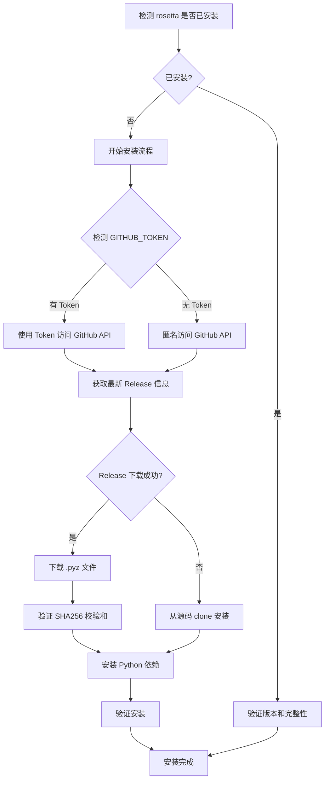

# Rosetta - Cross-DBMS SQL Testing & Benchmarking Toolkit

## Description

Rosetta 是一个跨数据库 SQL 测试与基准测试工具，支持在多个数据库（TDSQL、MySQL、TiDB、OceanBase 等）上执行 SQL，通过 MTR 风格的 `.test` 文件比较行为一致性，进行性能基准测试，并提供交互式 SQL playground，所有功能都配有可视化报告。

此 Skill 为用户自动安装和配置 rosetta 工具，使其能够快速开始跨数据库测试工作。

## When to Use This Skill

在以下场景中主动使用此 Skill：

1. **数据库一致性测试**：用户需要测试 SQL 在不同数据库中的行为一致性
   - 关键词：`MTR 测试`、`一致性测试`、`跨数据库测试`、`SQL 差异`

2. **性能基准测试**：用户需要对比不同数据库的查询性能
   - 关键词：`基准测试`、`性能测试`、`benchmark`、`性能对比`

3. **数据库连接检查**：用户需要验证多个数据库的连接状态
   - 关键词：`检查数据库连接`、`数据库状态`、`连接测试`

4. **SQL playground**：用户需要在多个数据库上快速执行 SQL 语句
   - 关键词：`执行 SQL`、`SQL playground`、`跨数据库执行`

5. **测试结果管理**：用户需要查看或管理历史测试结果
   - 关键词：`测试结果`、`历史记录`、`MTR 结果`、`benchmark 结果`

6. **配置管理**：用户需要配置或管理数据库连接信息
   - 关键词：`配置数据库`、`dbms config`、`数据库配置`

## Installation Flow

当用户首次使用此 Skill 时，会自动执行以下安装流程：



### 安装策略

1. **优先从 GitHub Release 下载**：
   - 下载预编译的 `.pyz` 文件（单文件可执行包）
   - 验证 SHA256 校验和确保文件完整性
   - 安装到 `~/.rosetta/bin/` 目录

2. **失败则从源码安装**：
   - Clone GitHub 仓库
   - 使用 pip install -e . 安装
   - 自动处理依赖关系

3. **智能 Token 检测**：
   - 自动检测 `GITHUB_TOKEN` 或 `GH_TOKEN` 环境变量
   - 有 Token 时使用认证访问（提高 API 限制）
   - 无 Token 时使用匿名访问（可能遇到速率限制）

### 依赖要求

- **Python**：>= 3.8
- **Python 包**：
  - pymysql >= 1.0
  - rich >= 13.0
  - prompt_toolkit >= 3.0

安装脚本会自动检查和安装这些依赖。

## Core Features

### 1. 数据库连接检查（status）

检查所有配置的数据库连接状态和版本信息。

**使用场景**：验证数据库配置是否正确，快速诊断连接问题。

### 2. SQL 执行（exec）

在多个数据库上执行 SQL 语句，并排对比结果。

**使用场景**：快速测试 SQL 在不同数据库中的行为差异。

### 3. MTR 一致性测试（mtr）

执行 `.test` 文件，比较 SQL 执行结果在不同数据库间的一致性，生成 HTML diff 报告。

**使用场景**：系统化测试 SQL 语法和行为的一致性，发现数据库兼容性问题。

### 4. 性能基准测试（bench）

在多个数据库上运行基准测试，对比查询性能。

**使用场景**：评估数据库性能，进行性能调优和对比分析。

### 5. 配置管理（config）

生成、查看和验证数据库配置文件。

**使用场景**：初始化配置，管理多个数据库连接信息。

### 6. 结果浏览（result）

浏览历史测试结果，查看详细信息。

**使用场景**：回顾和分析历史测试数据。

### 7. 交互式 REPL（interactive/i/repl）

启动交互式会话，支持即时执行 SQL、运行测试和基准测试。

**使用场景**：交互式开发和调试，快速迭代测试。

## Quick Start

安装完成后，按以下步骤开始使用：

```bash
# 1. 生成配置文件
rosetta config init

# 2. 编辑数据库连接信息
vim rosetta_config.json

# 3. 检查数据库连接
rosetta status

# 4. 执行 SQL 测试
rosetta exec --dbms mysql,tdsql --sql "SELECT VERSION()"

# 5. 运行 MTR 测试
rosetta mtr --dbms mysql,tdsql -t test.test

# 6. 运行性能测试
rosetta bench --dbms mysql,tdsql --file bench.json
```

## Configuration

### 数据库配置文件（rosetta_config.json）

配置文件示例：

```json
{
  "databases": [
    {
      "name": "mysql",
      "host": "127.0.0.1",
      "port": 3306,
      "user": "root",
      "password": "",
      "driver": "pymysql",
      "enabled": true
    },
    {
      "name": "tdsql",
      "host": "127.0.0.1",
      "port": 4000,
      "user": "root",
      "password": "",
      "driver": "pymysql",
      "enabled": true
    }
  ]
}
```

详细配置说明请参考 `references/config-guide.md`。

## Usage Examples

详细的命令使用示例请参考 `references/commands.md`，包括：

- 基本命令使用
- 高级参数配置
- 常见使用场景
- 最佳实践

### Natural Language Usage Best Practices

通过自然语言使用 rosetta 的最佳实践请参考 `references/best-practices-sop.md`，包括：

- 安装和初始化场景
- 数据库连接检查场景
- MTR 一致性测试场景
- 性能基准测试场景
- SQL Playground 场景
- 结果管理场景
- 故障排除场景
- 自然语言表达技巧

## Troubleshooting

遇到问题时，请参考 `references/troubleshooting.md`，包括：

- 安装问题诊断
- 连接问题排查
- 常见错误解决方案
- 性能问题调优

## Example Files

`examples/` 目录提供了以下示例文件：

- `rosetta_config.example.json`：数据库配置示例
- `bench.example.json`：基准测试配置示例

## Global Options

所有命令都支持以下全局选项：

| 参数 | 默认值 | 说明 |
|------|--------|------|
| `-j / --json` | `False` | JSON 输出（AI Agent 友好） |
| `-c / --config` | `rosetta_config.json` | 数据库配置文件路径 |
| `-v / --verbose` | `False` | 启用详细/调试日志 |

## Requirements

- Python >= 3.8
- 网络连接（用于下载和 GitHub 访问）
- 目标数据库的访问权限

## Support

- GitHub 仓库：https://github.com/sjyango/rosetta
- 问题反馈：https://github.com/sjyango/rosetta/issues
